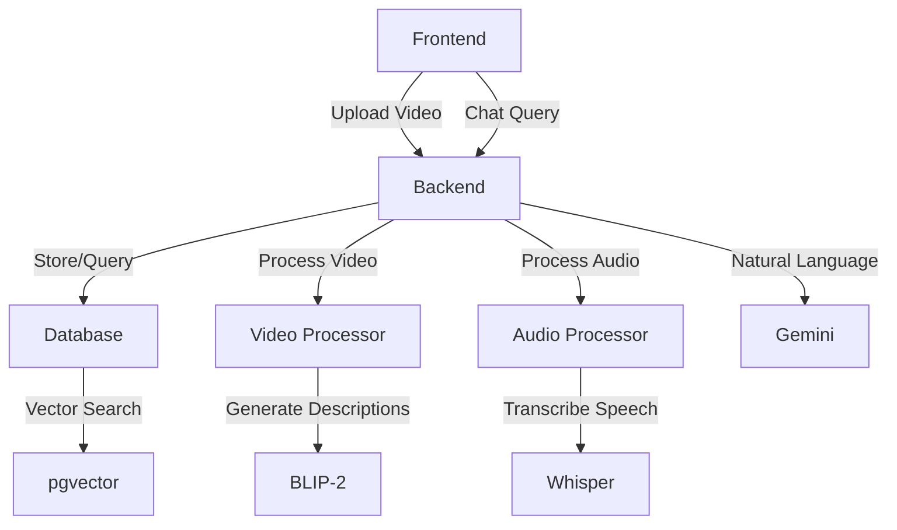

# 🎥 Video Chat Application

An intelligent video analysis application that allows you to chat with your videos using AI. Upload a video and ask questions about its visual content, audio transcription, or get comprehensive summaries.

## 📋 Table of Contents
- [Features](#-features)
- [Quick Start](#-quick-start)
- [Demo Script](#-demo-script)
- [Architecture](#-architecture)
- [Technical Pipeline](#-technical-pipeline)
- [Usage Examples](#-usage-examples)
- [Troubleshooting](#-troubleshooting)

## ✨ Features

- 🎬 **Video Processing**
  - Frame extraction and analysis
  - Visual scene description using BLIP-2
  - Intelligent frame sampling
  - Object and action detection
  
- 🔊 **Audio Processing**
  - Speech-to-text using Whisper
  - Smart audio segmentation
  - Timestamp synchronization
  - Natural speech break detection
  
- 🤖 **Intelligent Query System**
  - Automatic query classification (visual/audio/both/summary)
  - Context-aware responses
  - Semantic similarity search
  - Pre-generated video summaries
  
- 🔍 **Advanced Search**
  - Vector similarity search (pgvector)
  - Gap detection algorithm
  - Time-based context matching
  - Multi-modal result grouping

## 🚀 Quick Start

### Prerequisites
- [Docker Desktop](https://www.docker.com/products/docker-desktop/) installed and running
- 4GB RAM minimum
- 10GB free disk space

### One-Command Setup
```bash
# Clone the repository
git clone https://github.com/Daa06/VideoChatbot.git
cd VideoChatbot

# Start the application
./run_docker.sh
```

### Verify Installation
```bash
# In a new terminal
./test_setup.sh
```

### Access Points
- 📱 Frontend: http://localhost:8501
- 🔧 API: http://localhost:8000
- 📚 API Docs: http://localhost:8000/docs

## 🎬 Demo Script

### Available Test Videos
The project includes **2 sample videos** for testing and demonstration:
- **`pursuitofhappiness.mp4`** - Drama film scene with dialogue and emotional content
- **`tedtalk.mp4`** - Educational presentation with speaker and visual aids

These videos are located in the `videos/` directory and can be used to test all features of the application.

### What the Demo Shows
The `demo.py` script provides a **complete demonstration** of the video processing pipeline, showcasing all the core features required by the assignment:

#### ✅ **Video Processing in Action**
- Real-time progress bars showing video & audio processing
- Frame extraction with BLIP-2 visual descriptions
- Audio transcription with Whisper speech-to-text
- Intelligent highlight extraction using LLM

#### ✅ **Database Storage with Vector Embeddings**
- PostgreSQL + pgvector storage demonstration
- Vector embeddings generation for similarity search
- Timestamped highlights with descriptions
- Automatic video summary generation

#### 🔍 **Intelligent Query System**
- Query classification (visual/audio/both/summary)
- Vector similarity search demonstration
- Context-aware responses with Gemini LLM
- Multiple query types tested automatically

### How to Run the Demo

#### Prerequisites
Make sure the application is running:
```bash
./run_docker.sh
```

#### Run the Demo
```bash
# From the project root directory
docker compose exec backend python demo.py videos/your_video.mp4
```

#### Example with Sample Video
```bash
# Copy your video to the videos directory
cp /path/to/your/video.mp4 videos/

# Run the demo
docker compose exec backend python demo.py videos/your_video.mp4
```

### Demo Output
The script will show:

1. **🤖 Model Initialization**
   - Loading BLIP-2, Whisper, Gemini, and Sentence Transformers

2. **🎬 Video Processing**
   - Frame extraction and visual description generation
   - Audio transcription with timestamp segmentation

3. **🧠 LLM Highlight Extraction**
   - Intelligent moment selection and description generation

4. **💾 Database Storage**
   - Saving highlights with vector embeddings
   - Summary generation and storage

5. **📊 Results Display**
   - Visual descriptions table
   - Audio segments table
   - Generated summary preview

6. **🔍 Query Testing**
   - Automatic testing of different query types:
     - Summary: "What is the main topic of this video?"
     - Visual: "What are the people wearing?"
     - Audio: "What was said about Spartans?"
     - Combined: "What happened when they mentioned Athens?"

### Expected Demo Results
```
📹 Visual Descriptions Stored
┌─────────────┬─────────────────────────────────────────────┐
│ Timestamp   │ Description                                 │
├─────────────┼─────────────────────────────────────────────┤
│ 0.0s        │ a man in a black shirt and a black vest... │
│ 1.0s        │ a man with a beard and glasses looking...  │
└─────────────┴─────────────────────────────────────────────┘

🔊 Audio Segments Stored
┌─────────────┬─────────────────────────────────────────────┐
│ Time Range  │ Transcription                               │
├─────────────┼─────────────────────────────────────────────┤
│ 1.3s-4.1s   │ THAT'S A BIT OF A PROBLEM SAINT ROMAR      │
│ 4.2s-7.2s   │ HAS IT THE ATHENIANS HAVE ALREADY TURNED   │
└─────────────┴─────────────────────────────────────────────┘

📝 Generated Summary
This video appears to be a dramatic scene from a historical 
film, featuring dialogue about ancient Greek politics...
```

### Demo Features Demonstrated
- ✅ **OOP Architecture**: Clean separation of concerns
- ✅ **PostgreSQL + pgvector**: Vector similarity search
- ✅ **LLM Integration**: Gemini for chat and summaries
- ✅ **Docker Setup**: Containerized environment
- ✅ **Real-time Processing**: Progress indicators
- ✅ **Multi-modal Analysis**: Video + Audio processing

## 🏗️ Architecture

### System Components

#### 1. Frontend (Streamlit)
- User interface for video upload
- Real-time chat interface
- Progress indicators
- Result visualization

#### 2. Backend (FastAPI)
- RESTful API endpoints
- Asynchronous request handling
- WebSocket support for real-time updates
- Request validation and error handling

#### 3. Database (PostgreSQL + pgvector)
- Video metadata storage
- Vector embeddings for similarity search
- Timestamped highlights
- Pre-generated summaries

#### 4. AI Models
- **BLIP-2**: Visual scene description
- **Whisper**: Speech-to-text
- **Gemini**: Natural language understanding
- **Sentence Transformers**: Text embeddings

### Component Interaction


## 🐳 Docker Setup

### Services Architecture
```yaml
services:
  backend:    # FastAPI service
    - Port: 8000
    - Resources: 2-4 CPUs, 2-4GB RAM
    - Models: BLIP-2, Whisper, Gemini
    
  frontend:   # Streamlit UI
    - Port: 8501
    - Mounts: Source code for development
    
  database:   # PostgreSQL + pgvector
    - Port: 5433
    - Extensions: pgvector for embeddings
    - Volumes: Persistent data storage
```

### Key Features
- **Resource Management**: CPU and memory limits per service
- **Hot Reload**: Source code mounted for development
- **Persistent Storage**: Database and model caches preserved
- **Network Isolation**: Internal app-network for services
- **Health Checks**: Automatic container health monitoring

### Environment Variables
```bash
# Database Configuration
DB_HOST=db
DB_PORT=5432
DB_NAME=videochat
DB_USER=postgres
DB_PASSWORD=postgres

# API Keys (use .env file)
GEMINI_API_KEY=your_key_here
```

### Volume Mounts
- `./videos`: Uploaded video storage
- `postgres_data`: Database persistence
- `huggingface_cache`: AI model cache

### Development vs Production
#### Development
- Source code mounted for hot reload
- Debug logging enabled
- All ports exposed

#### Production
- Built images contain code
- Minimal port exposure
- Resource limits enforced

### Common Docker Commands
```bash
# Start all services
./run_docker.sh

# View logs
docker compose logs -f backend

# Restart single service
docker compose restart backend

# Clean reset
docker compose down -v
./run_docker.sh
```

## 🔄 Technical Pipeline

### 1. Video Upload Process
1. **File Reception**
   - Validate video format
   - Generate unique identifier
   - Create processing status tracker

2. **Video Processing**
   - Extract frames at dynamic intervals
   - Filter empty or duplicate frames
   - Generate visual descriptions using BLIP-2
   - Store frame timestamps and descriptions

3. **Audio Processing**
   - Extract audio stream
   - Convert to compatible format
   - Transcribe using Whisper
   - Segment based on natural breaks (>2s gaps)
   - Store timestamped segments

4. **Database Storage**
   - Store video metadata
   - Create vector embeddings
   - Link timestamps between audio and video
   - Generate and store video summary

### 2. Query Processing
1. **Query Classification**
   ```python
   query_type = classifier.classify(query)  # visual/audio/both/summary
   ```

2. **Search Strategy**
   - **Visual**: Search frame descriptions
   - **Audio**: Search transcription segments
   - **Both**: Match time-aligned audio-visual pairs
   - **Summary**: Return pre-generated summary

3. **Result Processing**
   - Filter by similarity scores
   - Apply gap detection
   - Group related content
   - Format response

### 3. Response Generation
1. **Context Building**
   - Gather relevant segments
   - Include timestamps
   - Add surrounding context

2. **Response Formatting**
   - Structure information
   - Add time references
   - Format for display

## 💬 Usage Examples

### Visual Questions
```
Q: "What is the person wearing?"
Q: "Describe the scene"
Q: "How many people are visible?"
```

### Audio Questions
```
Q: "What was said about Athens?"
Q: "What did they discuss?"
Q: "Who spoke first?"
```

### Combined Questions
```
Q: "What happened when they mentioned Spartans?"
Q: "Describe the scene during the dialogue"
```

### Summary Questions
```
Q: "What is the main topic?"
Q: "Summarize the key points"
```

## 🔧 Troubleshooting

### Common Issues

1. **Docker Issues**
   ```bash
   # Check Docker status
   docker info
   
   # Reset containers
   docker compose down
   ./run_docker.sh
   ```

2. **Performance Issues**
   - Ensure 4GB RAM minimum
   - Check CPU usage
   - Monitor disk space

3. **Upload Problems**
   - Check file format
   - Verify file size (<500MB recommended)
   - Ensure stable connection

### Getting Help
1. Check the logs:
   ```bash
   docker compose logs backend
   ```
2. Run tests:
   ```bash
   ./test_setup.sh
   ```
3. Check API status:
   ```bash
   curl http://localhost:8000/health
   ```

## 🤝 Contributing
1. Fork the repository
2. Create a feature branch
3. Make your changes
4. Run tests
5. Submit a pull request

## 🚀 Possible Improvements & Future Enhancements

Given more development time, several key improvements could significantly enhance the application's capabilities:

### 🧠 **Advanced LLM Integration**
- **Better Image Extraction Models**: Implement more sophisticated computer vision models like GPT-4V or Claude Vision for more accurate scene understanding
- **Multi-modal LLMs**: Integrate models that can simultaneously process video, audio, and text for more coherent analysis
- **Specialized Video LLMs**: Use models specifically trained on video content for better temporal understanding

### 👥 **Speaker Identification & Separation**
- **Speaker Diarization**: Implement AI models to automatically identify and separate different speakers in conversations
- **Voice Recognition**: Add capability to recognize specific individuals across multiple videos
- **Speaker-specific Summaries**: Generate separate summaries for each participant in discussions or interviews

### 🎯 **Enhanced Content Analysis**
- **Emotion Detection**: Analyze facial expressions and voice tone to detect emotional states
- **Action Recognition**: Implement advanced models to identify specific actions and activities in videos
- **Object Tracking**: Track objects and people across video frames for better continuity understanding
- **Scene Segmentation**: Automatically detect scene changes and topic transitions

### 🔍 **Improved Search & Retrieval**
- **Semantic Search**: Implement more sophisticated semantic search using advanced embedding models
- **Temporal Queries**: Enable time-based queries like "What happened before/after X event?"
- **Cross-video Search**: Search across multiple videos simultaneously
- **Visual Similarity Search**: Find visually similar scenes across different videos

### 📊 **Analytics & Insights**
- **Content Analytics**: Provide detailed statistics about video content (speaking time, topics covered, etc.)
- **Trend Analysis**: Identify patterns and trends across multiple videos
- **Automatic Tagging**: Generate relevant tags and categories automatically
- **Content Moderation**: Implement automatic detection of inappropriate content

### 🎨 **User Experience Enhancements**
- **Interactive Timeline**: Visual timeline with clickable highlights and thumbnails
- **Real-time Processing**: Stream processing for live video analysis
- **Mobile Application**: Native mobile apps for iOS and Android
- **Advanced Visualization**: Interactive charts and graphs for video insights

### ⚡ **Performance & Scalability**
- **GPU Acceleration**: Optimize models for GPU processing to handle larger videos
- **Distributed Processing**: Implement distributed computing for processing multiple videos simultaneously
- **Caching Strategies**: Advanced caching for frequently accessed content
- **Cloud Integration**: Support for cloud storage and processing services

### 🔧 **Technical Improvements**
- **Model Fine-tuning**: Fine-tune models on domain-specific video content
- **Batch Processing**: Process multiple videos in parallel
- **API Rate Limiting**: Implement proper rate limiting and authentication
- **Monitoring & Logging**: Comprehensive system monitoring and error tracking

These improvements would transform the application from a functional prototype into a production-ready, enterprise-grade video analysis platform capable of handling diverse use cases and large-scale deployments.

## 📄 License
This project is open source and available under the MIT License.

# Test_for_team_AI
## submission  
- Submit the assignment only on Github or GitLab.  
---

## 📹 **Step 1: Video Processor with LLM-Based Highlight Extraction**

### 🎯 Task Overview:
Build a **Python-based video processing tool** that extracts descriptive highlights from videos using an **LLM (Large Language Model)**. The processed highlights should be stored in a **PostgreSQL database using pgvector** for similarity-based retrieval.

### ✅ Requirements:

#### Functional Goals:
1. Accept video files as input (e.g., `.mp4`, `.mov`).
2. Automatically extract **visual and audio descriptions** (e.g., scenes, objects, speech-to-text).
3. Use an **LLM** to:
   - Select **important moments** (e.g., explosions, people speaking, vehicle movement).
   - Generate **detailed descriptions** for each moment.
4. Save each highlight to a **PostgreSQL database** with:
   - `timestamp`
   - `description`
   - `video_id`
   - `embedding (pgvector)`
   - `
