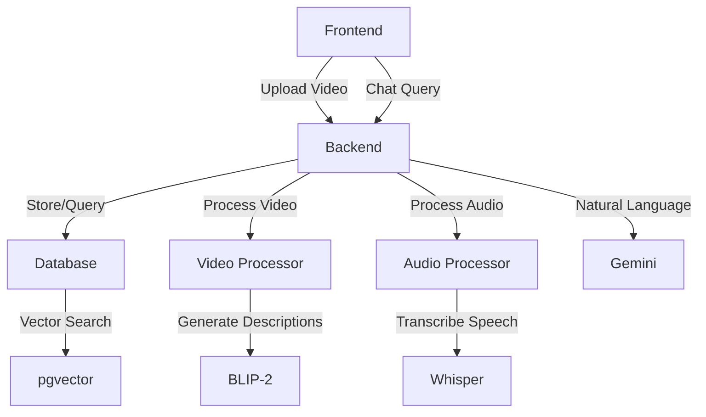

# 🎥 Video Chat Application

An intelligent video analysis application that allows you to chat with your videos using AI. Upload a video and ask questions about its visual content, audio transcription, or get comprehensive summaries.

## 📋 Table of Contents
- [Features](#-features)
- [Quick Start](#-quick-start)
- [Architecture](#-architecture)
- [Technical Pipeline](#-technical-pipeline)
- [Usage Examples](#-usage-examples)
- [Troubleshooting](#-troubleshooting)

## ✨ Features

- 🎬 **Video Processing**
  - Frame extraction and analysis
  - Visual scene description using BLIP-2
  - Intelligent frame sampling
  - Object and action detection
  
- 🔊 **Audio Processing**
  - Speech-to-text using Whisper
  - Smart audio segmentation
  - Timestamp synchronization
  - Natural speech break detection
  
- 🤖 **Intelligent Query System**
  - Automatic query classification (visual/audio/both/summary)
  - Context-aware responses
  - Semantic similarity search
  - Pre-generated video summaries
  
- 🔍 **Advanced Search**
  - Vector similarity search (pgvector)
  - Gap detection algorithm
  - Time-based context matching
  - Multi-modal result grouping

## 🚀 Quick Start

### Prerequisites
- [Docker Desktop](https://www.docker.com/products/docker-desktop/) installed and running
- 4GB RAM minimum
- 10GB free disk space

### One-Command Setup
```bash
# Clone the repository
git clone https://github.com/Daa06/VideoChatbot.git
cd VideoChatbot

# Start the application
./run_docker.sh
```

### Verify Installation
```bash
# In a new terminal
./test_setup.sh
```

### Access Points
- 📱 Frontend: http://localhost:8501
- 🔧 API: http://localhost:8000
- 📚 API Docs: http://localhost:8000/docs

## 🏗️ Architecture

### System Components

#### 1. Frontend (Streamlit)
- User interface for video upload
- Real-time chat interface
- Progress indicators
- Result visualization

#### 2. Backend (FastAPI)
- RESTful API endpoints
- Asynchronous request handling
- WebSocket support for real-time updates
- Request validation and error handling

#### 3. Database (PostgreSQL + pgvector)
- Video metadata storage
- Vector embeddings for similarity search
- Timestamped highlights
- Pre-generated summaries

#### 4. AI Models
- **BLIP-2**: Visual scene description
- **Whisper**: Speech-to-text
- **Gemini**: Natural language understanding
- **Sentence Transformers**: Text embeddings

### Component Interaction


## 🔄 Technical Pipeline

### 1. Video Upload Process
1. **File Reception**
   - Validate video format
   - Generate unique identifier
   - Create processing status tracker

2. **Video Processing**
   - Extract frames at dynamic intervals
   - Filter empty or duplicate frames
   - Generate visual descriptions using BLIP-2
   - Store frame timestamps and descriptions

3. **Audio Processing**
   - Extract audio stream
   - Convert to compatible format
   - Transcribe using Whisper
   - Segment based on natural breaks (>2s gaps)
   - Store timestamped segments

4. **Database Storage**
   - Store video metadata
   - Create vector embeddings
   - Link timestamps between audio and video
   - Generate and store video summary

### 2. Query Processing
1. **Query Classification**
   ```python
   query_type = classifier.classify(query)  # visual/audio/both/summary
   ```

2. **Search Strategy**
   - **Visual**: Search frame descriptions
   - **Audio**: Search transcription segments
   - **Both**: Match time-aligned audio-visual pairs
   - **Summary**: Return pre-generated summary

3. **Result Processing**
   - Filter by similarity scores
   - Apply gap detection
   - Group related content
   - Format response

### 3. Response Generation
1. **Context Building**
   - Gather relevant segments
   - Include timestamps
   - Add surrounding context

2. **Response Formatting**
   - Structure information
   - Add time references
   - Format for display

## 💬 Usage Examples

### Visual Questions
```
Q: "What is the person wearing?"
Q: "Describe the scene"
Q: "How many people are visible?"
```

### Audio Questions
```
Q: "What was said about Athens?"
Q: "What did they discuss?"
Q: "Who spoke first?"
```

### Combined Questions
```
Q: "What happened when they mentioned Spartans?"
Q: "Describe the scene during the dialogue"
```

### Summary Questions
```
Q: "What is the main topic?"
Q: "Summarize the key points"
```

## 🔧 Troubleshooting

### Common Issues

1. **Docker Issues**
   ```bash
   # Check Docker status
   docker info
   
   # Reset containers
   docker compose down
   ./run_docker.sh
   ```

2. **Performance Issues**
   - Ensure 4GB RAM minimum
   - Check CPU usage
   - Monitor disk space

3. **Upload Problems**
   - Check file format
   - Verify file size (<500MB recommended)
   - Ensure stable connection

### Getting Help
1. Check the logs:
   ```bash
   docker compose logs backend
   ```
2. Run tests:
   ```bash
   ./test_setup.sh
   ```
3. Check API status:
   ```bash
   curl http://localhost:8000/health
   ```

## 🤝 Contributing
1. Fork the repository
2. Create a feature branch
3. Make your changes
4. Run tests
5. Submit a pull request

## 📄 License
This project is open source and available under the MIT License.

# Test_for_team_AI
## submission  
- Submit the assignment only on Github or GitLab.  
---

## 📹 **Step 1: Video Processor with LLM-Based Highlight Extraction**

### 🎯 Task Overview:
Build a **Python-based video processing tool** that extracts descriptive highlights from videos using an **LLM (Large Language Model)**. The processed highlights should be stored in a **PostgreSQL database using pgvector** for similarity-based retrieval.

### ✅ Requirements:

#### Functional Goals:
1. Accept video files as input (e.g., `.mp4`, `.mov`).
2. Automatically extract **visual and audio descriptions** (e.g., scenes, objects, speech-to-text).
3. Use an **LLM** to:
   - Select **important moments** (e.g., explosions, people speaking, vehicle movement).
   - Generate **detailed descriptions** for each moment.
4. Save each highlight to a **PostgreSQL database** with:
   - `timestamp`
   - `description`
   - `video_id`
   - `embedding (pgvector)`
   - `LLM-generated summary`

#### Technical Constraints:
- ✅ Must use **Python**
- ✅ Must use **LMM** Help for chat
- ✅ Must store data in a **PostgreSQL + pgvector** database.
- ✅ Must follow **OOP principles** with good folder structure and separation of concerns (`processors`, `database`, `llm`, etc.).
- ✅ Must include a **Docker setup** for both the Python service and PostgreSQL (with pgvector extension).
- ✅ Must contain a **demo script** showing:
   - Video processing in action
   - Output descriptions being saved to DB

#### Deliverables:
- Python code with OOP structure
- Docker setup (`docker-compose.yml`)
- PostgreSQL schema
- ✅ A very neat and **clear README** 


## Note:
- **The examinee must select the videos. A proper video is between thirty seconds and a minute and a half. The video must be uploaded along with the assignment, At least two videos must be selected.**
- You can use free key  " https://aistudio.google.com/ "
---

## 💬 **Step 2: Interactive Chat About Video Highlights**

### 🎯 Task Overview:
Extend your system to allow users to **chat with a React frontend** and ask questions about the processed video highlights.

### ✅ Requirements:

#### Functional Goals:
1. Build a **Free choice frontend** that allows users to:
   - Enter a question (e.g., *"What happened after the person got out of the car?"*)
   - See answers pulled **only from the database**
2. Build a **Python backend (FastAPI recommended)** that:
   - Accepts chat questions
   - Uses embeddings or keyword search to match relevant highlights from the DB
   - Responds only with content from the database (no real-time LLM response)
   - Structures responses coherently based on matching highlights

#### Technical Constraints:
- ✅ Frontend in **Free choice**
- ✅ Backend in **Python** (FastAPI preferred)
- ✅ Adheres to **OOP structure** for API, data access layer, and chat logic
- ✅ Uses Docker for both frontend and backend
- ✅ Backend must pull data **only from the database** (LLM is not used in this step)
- ✅ Clean modular architecture and routing in both React and Python
- ✅ Include a **neat README** that explains:
   - How to start each container
   - Chat architecture
   - Endpoint flow

---

## 🧠 **Bonus Task: Neural Network Tic-Tac-Toe Player**

### 🎯 Task Overview:
Implement a simple neural network that learns to play **Tic-Tac-Toe** using self-play or predefined rules. Provide both a **training visualization** and a **game interface**.

### ✅ Requirements:

#### Part 1: Model Training
- Implement a **basic neural network** in PyTorch or TensorFlow.
- Train it to play against:
  - Random moves (Easy)
  - Heuristic opponent (Medium)
  - Itself (Hard)
- Log training process (e.g., win rate, loss, move preference)

#### Part 2: Game Interface
- Display the game board using a simple GUI (Tkinter, PyGame, or web-based)
- Let the user select difficulty (Easy, Medium, Hard)
- Show the model's move in real time

#### Bonus Points:
- Add visual feedback for the training process (matplotlib loss curves, win stats)
- Enable human-vs-AI play mode

