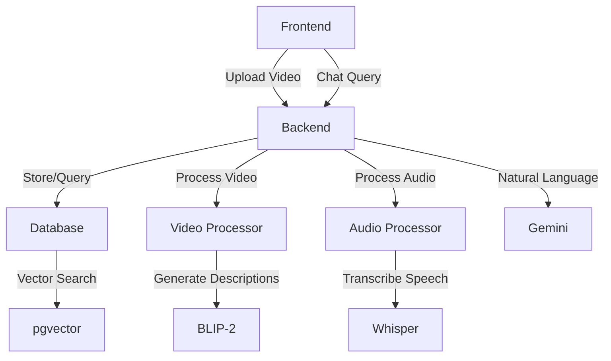

# 🎥 Video Chat Application

An intelligent video analysis application that allows you to chat with your videos using AI. Upload a video and ask questions about its visual content, audio transcription, or get comprehensive summaries.

## 📋 Table of Contents
- [Features](#-features)
- [Quick Start](#-quick-start)
- [Architecture](#-architecture)
- [Technical Pipeline](#-technical-pipeline)
- [Usage Examples](#-usage-examples)
- [Troubleshooting](#-troubleshooting)

## ✨ Features

- 🎬 **Video Processing**
  - Frame extraction and analysis
  - Visual scene description using BLIP-2
  - Intelligent frame sampling
  - Object and action detection
  
- 🔊 **Audio Processing**
  - Speech-to-text using Whisper
  - Smart audio segmentation
  - Timestamp synchronization
  - Natural speech break detection
  
- 🤖 **Intelligent Query System**
  - Automatic query classification (visual/audio/both/summary)
  - Context-aware responses
  - Semantic similarity search
  - Pre-generated video summaries
  
- 🔍 **Advanced Search**
  - Vector similarity search (pgvector)
  - Gap detection algorithm
  - Time-based context matching
  - Multi-modal result grouping

## 🚀 Quick Start

### Prerequisites
- [Docker Desktop](https://www.docker.com/products/docker-desktop/) installed and running
- 4GB RAM minimum
- 10GB free disk space

### One-Command Setup
```bash
# Clone the repository
git clone https://github.com/Daa06/VideoChatbot.git
cd VideoChatbot

# Start the application
./run_docker.sh
```

### Verify Installation
```bash
# In a new terminal
./test_setup.sh
```

### Access Points
- 📱 Frontend: http://localhost:8501
- 🔧 API: http://localhost:8000
- 📚 API Docs: http://localhost:8000/docs

## 🏗️ Architecture

### System Components

#### 1. Frontend (Streamlit)
- User interface for video upload
- Real-time chat interface
- Progress indicators
- Result visualization

#### 2. Backend (FastAPI)
- RESTful API endpoints
- Asynchronous request handling
- WebSocket support for real-time updates
- Request validation and error handling

#### 3. Database (PostgreSQL + pgvector)
- Video metadata storage
- Vector embeddings for similarity search
- Timestamped highlights
- Pre-generated summaries

#### 4. AI Models
- **BLIP-2**: Visual scene description
- **Whisper**: Speech-to-text
- **Gemini**: Natural language understanding
- **Sentence Transformers**: Text embeddings

### Component Interaction


## 🐳 Docker Setup

### Services Architecture
```yaml
services:
  backend:    # FastAPI service
    - Port: 8000
    - Resources: 2-4 CPUs, 2-4GB RAM
    - Models: BLIP-2, Whisper, Gemini
    
  frontend:   # Streamlit UI
    - Port: 8501
    - Mounts: Source code for development
    
  database:   # PostgreSQL + pgvector
    - Port: 5433
    - Extensions: pgvector for embeddings
    - Volumes: Persistent data storage
```

### Key Features
- **Resource Management**: CPU and memory limits per service
- **Hot Reload**: Source code mounted for development
- **Persistent Storage**: Database and model caches preserved
- **Network Isolation**: Internal app-network for services
- **Health Checks**: Automatic container health monitoring

### Environment Variables
```bash
# Database Configuration
DB_HOST=db
DB_PORT=5432
DB_NAME=videochat
DB_USER=postgres
DB_PASSWORD=postgres

# API Keys (use .env file)
GEMINI_API_KEY=your_key_here
```

### Volume Mounts
- `./videos`: Uploaded video storage
- `postgres_data`: Database persistence
- `huggingface_cache`: AI model cache

### Development vs Production
#### Development
- Source code mounted for hot reload
- Debug logging enabled
- All ports exposed

#### Production
- Built images contain code
- Minimal port exposure
- Resource limits enforced

### Common Docker Commands
```bash
# Start all services
./run_docker.sh

# View logs
docker compose logs -f backend

# Restart single service
docker compose restart backend

# Clean reset
docker compose down -v
./run_docker.sh
```

## 🔄 Technical Pipeline

### 1. Video Upload Process
1. **File Reception**
   - Validate video format
   - Generate unique identifier
   - Create processing status tracker

2. **Video Processing**
   - Extract frames at dynamic intervals
   - Filter empty or duplicate frames
   - Generate visual descriptions using BLIP-2
   - Store frame timestamps and descriptions

3. **Audio Processing**
   - Extract audio stream
   - Convert to compatible format
   - Transcribe using Whisper
   - Segment based on natural breaks (>2s gaps)
   - Store timestamped segments

4. **Database Storage**
   - Store video metadata
   - Create vector embeddings
   - Link timestamps between audio and video
   - Generate and store video summary

### 2. Query Processing
1. **Query Classification**
   ```python
   query_type = classifier.classify(query)  # visual/audio/both/summary
   ```

2. **Search Strategy**
   - **Visual**: Search frame descriptions
   - **Audio**: Search transcription segments
   - **Both**: Match time-aligned audio-visual pairs
   - **Summary**: Return pre-generated summary

3. **Result Processing**
   - Filter by similarity scores
   - Apply gap detection
   - Group related content
   - Format response

### 3. Response Generation
1. **Context Building**
   - Gather relevant segments
   - Include timestamps
   - Add surrounding context

2. **Response Formatting**
   - Structure information
   - Add time references
   - Format for display

## 💬 Usage Examples

### Visual Questions
```
Q: "What is the person wearing?"
Q: "Describe the scene"
Q: "How many people are visible?"
```

### Audio Questions
```
Q: "What was said about Athens?"
Q: "What did they discuss?"
Q: "Who spoke first?"
```

### Combined Questions
```
Q: "What happened when they mentioned Spartans?"
Q: "Describe the scene during the dialogue"
```

### Summary Questions
```
Q: "What is the main topic?"
Q: "Summarize the key points"
```

## 🔧 Troubleshooting

### Common Issues

1. **Docker Issues**
   ```bash
   # Check Docker status
   docker info
   
   # Reset containers
   docker compose down
   ./run_docker.sh
   ```

2. **Performance Issues**
   - Ensure 4GB RAM minimum
   - Check CPU usage
   - Monitor disk space

3. **Upload Problems**
   - Check file format
   - Verify file size (<500MB recommended)
   - Ensure stable connection

### Getting Help
1. Check the logs:
   ```bash
   docker compose logs backend
   ```
2. Run tests:
   ```bash
   ./test_setup.sh
   ```
3. Check API status:
   ```bash
   curl http://localhost:8000/health
   ```

## 🤝 Contributing
1. Fork the repository
2. Create a feature branch
3. Make your changes
4. Run tests
5. Submit a pull request

## 📄 License
This project is open source and available under the MIT License.

# Test_for_team_AI
## submission  
- Submit the assignment only on Github or GitLab.  
---

## 📹 **Step 1: Video Processor with LLM-Based Highlight Extraction**

### 🎯 Task Overview:
Build a **Python-based video processing tool** that extracts descriptive highlights from videos using an **LLM (Large Language Model)**. The processed highlights should be stored in a **PostgreSQL database using pgvector** for similarity-based retrieval.

### ✅ Requirements:

#### Functional Goals:
1. Accept video files as input (e.g., `.mp4`, `.mov`).
2. Automatically extract **visual and audio descriptions** (e.g., scenes, objects, speech-to-text).
3. Use an **LLM** to:
   - Select **important moments** (e.g., explosions, people speaking, vehicle movement).
   - Generate **detailed descriptions** for each moment.
4. Save each highlight to a **PostgreSQL database** with:
   - `timestamp`
   - `description`
   - `video_id`
   - `embedding (pgvector)`
   - `